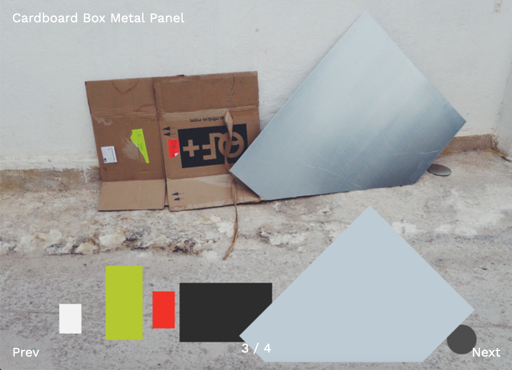

# Boyce slideshow 

I built this web site completely from scratch using Java Script and Jquery. This site contains a full screen slideshow that changes when using the previous and next buttons and automatically plays, every few seconds a slide moves to the next one. Every time we make an update, we can see in what slide we are on thanks to the numbers at the bottom of the page.
 

You can check this site [here](https://boyce-slideshow-438.superhi.com) 

